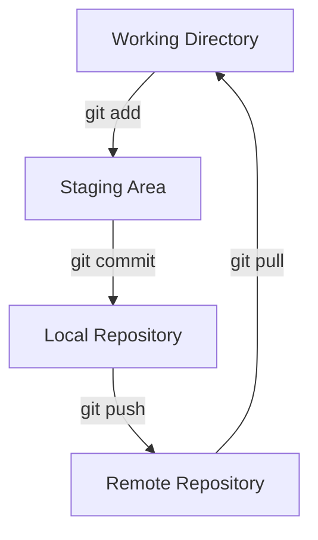

# Week 1: User stories, agency website
- [Week 01](https://learn.foundersandcoders.com/course/syllabus/developer/week01-project01-basics/learning-outcomes/)

## Assessment
 ### 1. Learning outcomes

  #### Agency website learning
  * Connect JSON data in node.js as well as browser environments
  * Dynamically generate website content from datasets in javascript
  * Using forms in HTML and preparing that data to be submitted to external database (database connection pending..)
  * Making a website navbar for single page format
  * Connecting icon libraries for inserting logos in vextorised format that can be manipulated using CSS
  * Using figma basics
  * CSS variables - very useful to centralise variables in your CSS in order to be able to make changes quickly
  * Merge conflicts and how to avoid them (sometimes!)
  
  #### Group discussions learning
  * What an EC2 deployment is in AWS (learned based on discussion with other group)
  * Connecting database data into your javascript's browser environment using Supabase (thanks Ben!)
  * Dynamic colour schemes using CSS and javascript
  * Infinite scrollbar and parallax as concepts, not in practice
  
  #### Workshop leaning
  * Accessing the pokemon API! Wow cool!
  * Searching through json datasets using its keys and callbacks inside promises
  * Fetch requests in javascript using GET and POST methods (workshop), sending form data to an API
  * Sending user inputs using forms and POST method fetch requests


 ### 2. Show an example of some of the learning outcomes you have struggled with and/or would like to re-visit.
  * I really struggled making sense of CSS in a group environment, without full knowledge of what everyone else has contributed it can be difficult to find bugs
  * I struggled a bit with Git and merge conflicts
  * Figma design

## Feedback (For CF's)
[**Course Facilitator name**]  

Alexander

[*What went well*]

Very good progress log. You show a broad spectrum of learnings and you specifically mention all the required ones plus some very interesting stretches.

[*Even better if*]

It would be great if you could add short code snippets of code or commands, screenshots, mermaid diagrams... to support some of the ideas.

For example, you could add a brief git workflow diagram using Mermaid:



Or you could include a short code snippet to illustrate a concept you learned, like DOM manipulation:

```javascript
// Example of DOM manipulation
const newElement = document.createElement('div');
newElement.textContent = 'Hello, World!';
document.body.appendChild(newElement);
```

Adding these kinds of examples can make your progress log more informative and easier to review in the future.
